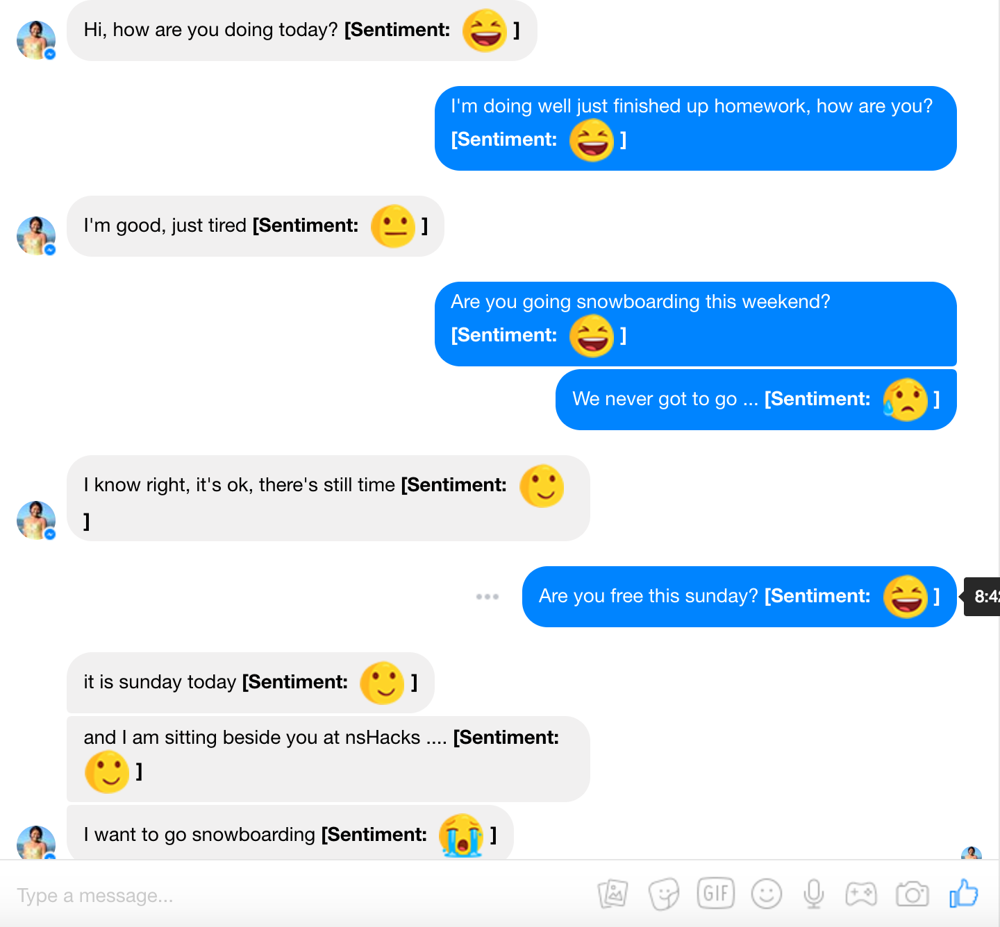
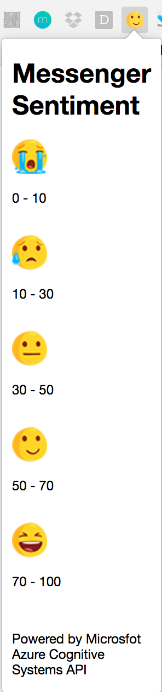

Messenger Sentiment

1. Clone repo to local 
2. Open Chrome and under Extensions -> "load unpacked extension"
3. Open www.messenger.com
4. Reload the page and enjoy the sentiments! 

nwHacks2017: https://devpost.com/Eden0097
==========

